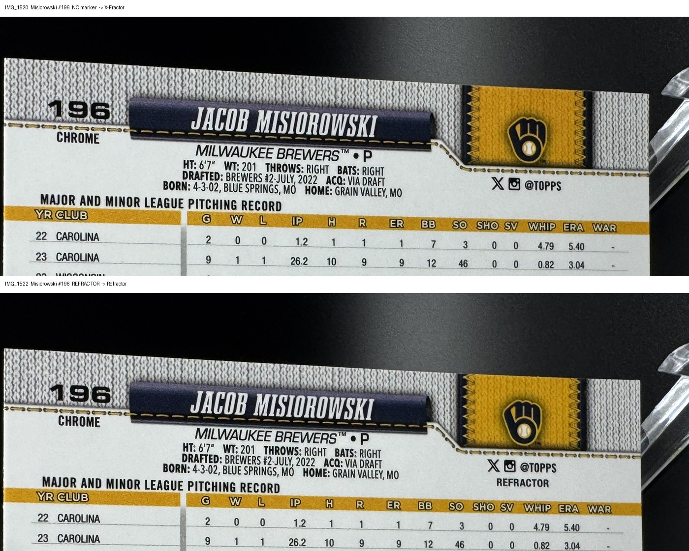
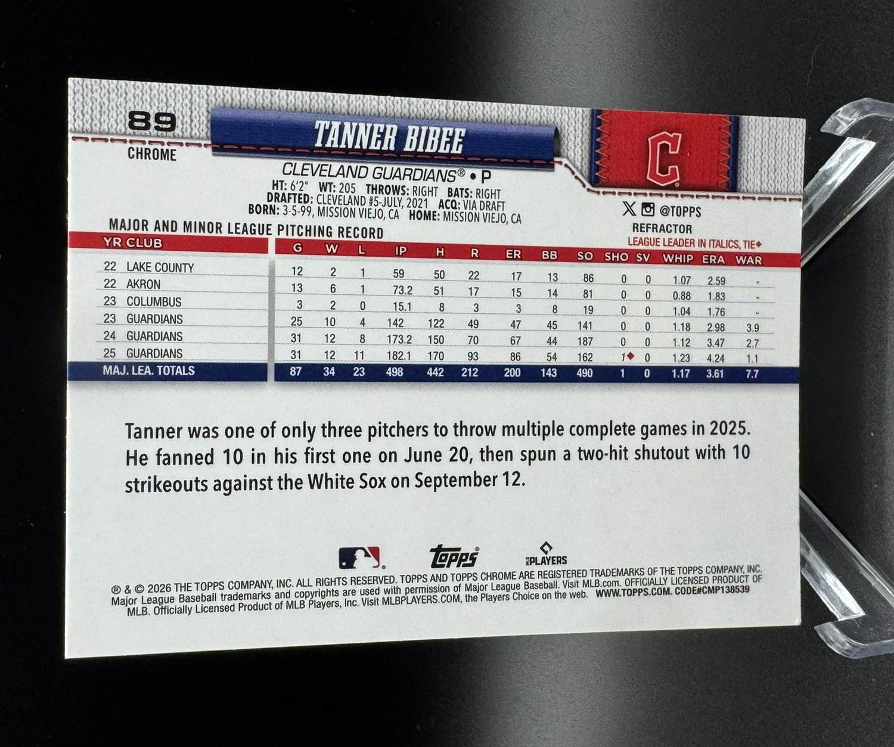
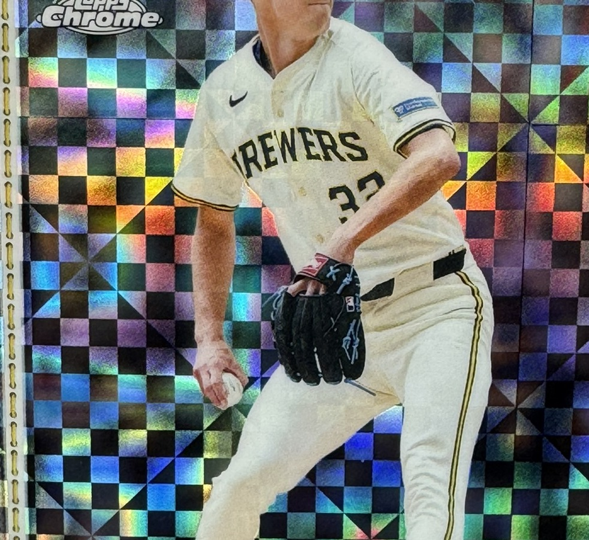

# Card intake

Read this before looking at a single card photo. Every rule below exists because
the same mistake was made more than once.

## 0. Scope

Section 1 (the back marker) is verified on **2026 Topps Chrome only**. Michael's
standing caution: *"this refractor rule probably only applies to topps chrome
2026."* Treat it as unverified for any other product, including Bowman Chrome,
Topps Finest, Sapphire and earlier Chrome years.

For a product not on that list, do **not** assume the marker exists or sits in
the same place. Find a control pair first: two copies of the same card number
where the parallel differs, and see what actually changes on the back. Until you
have that, flag the card `confirm parallel` rather than guessing (section 6),
and update this skill once a product is confirmed.

## 1. The parallel marker (2026 Topps Chrome). Do not do this from memory.

The two words live in **opposite top corners**, which is why every prose
description of them gets transposed between sessions. This has now been
"discovered" three times. Look at the picture instead:



Same player, same card number, photographed minutes apart. The only difference
is the word under `@TOPPS`.

| word | where it sits | what it means |
|---|---|---|
| `CHROME` | top **LEFT**, directly under the card number | **nothing.** It is on every single card. It is never the tell. |
| `REFRACTOR` | top **RIGHT**, directly under `@TOPPS`, beside the team logo | this card is a **Refractor** |

Full upright back for orientation: 

### Decision procedure

1. Orient the back **upright** first. These get photographed rotated 90 degrees,
   and a rotated card is how "left" and "right" get swapped.
2. Find `@TOPPS` in the top right, next to the team logo.
3. Look **directly under `@TOPPS`**:
   - word `REFRACTOR` present -> **Refractor**
   - nothing there -> not a Refractor; go to step 4
4. Now look at the **front**. Checkerboard foil pattern -> **X-Fractor**.
   
   The X-Fractor back is **unmarked**, identical to a base back. The back can
   never identify an X-Fractor. Only the front can.
5. No `REFRACTOR` on the back **and** no checkerboard on the front -> **base**.

You need **both faces** for every card. A parallel call from one face is a guess.

### If you cannot read it, zoom

The marker is small print. Do not squint at a full-frame photo. Crop the card's
bounding box, take the top-right region, upscale 3x with LANCZOS, and read that.
Guessing between base and Refractor has cost real money: four cards once went
into a $1.99 dropdown as base when they were Refractors.

## 2. Numbered parallels

The serial (`026/199`) is printed on the **front**, usually lower-left, and is
routinely half-hidden behind a player's leg or the acrylic stand. Crop and
upscale it. If a digit is genuinely obscured, record what you can read and say
in the note which digit needs confirming off the card. Never round a serial to
a "probably".

Colour names are not guessable. If you cannot source the exact parallel name,
record the colour plus the serial (`Aqua X-Fractor /199`) and flag it rather
than inventing a Topps product name.

`Lazer Refractor` is spelled with a **z**. That is Topps' own spelling, not a
typo. eBay keyword search cannot settle a spelling question, it just matches
whatever you typed.

## 3. Inserts: the code prefix decides the set

The insert code in `card_number` is the **authority** on `set_name`. Never file
an insert under plain `2026 Topps Chrome`, and never invent a new spelling of an
insert name. Canonical values:

Names below are taken from the **official Topps checklist PDF**, not from
whatever spelling was already most common in the table. Two of them were wrong
when guessed that way: the `91CB-` insert is "1991 Topps **Baseball**", not
"1991 Topps 75 Years", and `BTP-` is "Big Ticket **Players**", plural.

| prefix | set_name |
|---|---|
| `91CB-` | `2026 Topps Chrome (1991 Topps Baseball insert)` |
| `PTP-` | `2026 Topps Chrome (Past to Present insert)` |
| `BTP-` | `2026 Topps Chrome (Big Ticket Players insert)` |
| `RVA-` | `2026 Topps Chrome (Chrome Rivals insert)` (AWAY variant) |
| `RVH-` | `2026 Topps Chrome (Chrome Rivals insert)` (HOME variant) |
| `WC-` | `2026 Topps Chrome (Wrecking Crew insert)` |
| `FS-` | `2026 Topps Chrome (Future Stars insert)` |
| `SN-` | `2026 Topps Chrome (Static Noise insert)` |
| `DM-` | `2026 Topps Chrome (Diamond Moments insert)` |
| `IS-` | `2026 Topps Chrome (Ink Strokes autographs)` |
| `RA-` | `2026 Topps Chrome (Rookie Autographs)` |
| `P-` | `2026 Topps Chrome (Perspectives insert)` |

Test `PTP-` and `BTP-` **before** `P-`, or the prefix match swallows them.

A prefix missing from that table is worse than a wrong set name: the card stays
in base Chrome and disappears from the insert count entirely. `RVH-` was missing
at first and stranded a Reggie Jackson. Before trusting a count, list every
letter-coded `card_number` whose prefix is not in the table and resolve each one.

**Do not ask Michael what an unknown code means, and do not invent it. Look it
up on the checklist.** Every Topps product publishes one, and retailers host the
PDF (`steelcitycollectibles.com/storage/pdf/product_checklists/...`). Beckett and
checklistinsider.com carry them too. `topps.com` returns 403 to WebFetch; curl
with a browser user-agent gets through.

## 3a. Verify the whole vault against the checklist

The checklist is the only source that can catch a misread the photos agree on.

```
python scripts/parse-checklist.py <checklist.pdf> <out.json>
npx tsx scripts/verify-against-checklist.ts <out.json>
```

It matches `card_number -> player` for every letter-coded card and reports
mismatches and codes that do not exist. Two parsing traps, both already handled
in the script and both of which silently turn every double-digit card into an
"unknown code": the PDF extracts the code glued to the name (`BTP-11Juan Soto`),
so a greedy suffix eats the leading capital, and accented names lose their
characters to U+FFFD, so the comparison treats U+FFFD as a wildcard. Past to
Present entries list only the present-day player, so match on **any** surname.

Run `npx tsx scripts/normalize-insert-sets.ts` after any ingest as a check. It
only touches `2026 Topps Chrome%`; Finest and Bowman have their own families.

## 4. Photos

- Cards are shot **front, back, front, back**. Confirm the pairing on the first
  two files rather than assuming it.
- **A missing file flips the parity for everything after it.** In the 08-15 drop
  `IMG_1569` did not exist, so 1511-1568 ran odd=front while 1570-1585 ran
  even=front. Check the file list for gaps before mapping pairs.
- Assert in the ingest script that every photo is claimed by exactly one card
  and no photo on disk is left orphaned. Both checks have caught real errors.
- Upload to Supabase, verify each URL resolves, and only then archive the
  originals to `eBay_assets/_originals/`. Move, never delete.

## 5. Before inserting rows

- **Check for an existing row** with the same player + set + card number +
  parallel. Michael has twice caught a second listing being minted for a card
  he already had live at quantity 2. If it already exists and is listed, raise
  the quantity instead of creating a rival row.
- Genuine second copies from a different rip are fine, but **say so explicitly**
  in the report so he can check them against the team bags.
- Not every card belongs in the vault: no plain base unless it is an RC, a big
  name, or an MVP buyback candidate. An unexplained base card is usually a
  misread Refractor, so re-check step 1 before filing one.

## 5a. After every ingest, run the collision check

Two different players cannot hold the same `card_number` inside one set. When
they do, a number was misread. This single query found three misreads that had
been live for weeks (`WC-15` Roman Anthony was really `WC-25`, and two Ohtani
base cards logged as `#7` were really `#1`):

```sql
SELECT set_name, card_number, string_agg(DISTINCT player, ' | ') players
FROM baseball_cards
WHERE card_number IS NOT NULL AND card_number <> 'UNKNOWN'
GROUP BY 1,2 HAVING count(DISTINCT player) > 1;
```

Resolve each hit by **re-reading both cards' photos**, never by picking the one
that looks more likely. `scripts/fix-card-misreads-0816.ts` is the pattern: it
asserts the current value matches what you expect before writing, so a stale fix
cannot clobber a corrected row.

Beware of reporting bugs too. Any inventory grouped by `card_number` alone will
hide one of the two players behind a false `x2`. Group by number **and** player.

## 5b. Counts are a floor, not the truth

Michael photographs **one** copy of the cheap inserts, because they sell through
a quantity dropdown rather than as individual listings. So the vault legitimately
holds fewer rows than his team bags, and a gap is not automatically an error.
Ask before chasing one. When he reports bag counts, add the extra copies as
`needs_photos` with an empty `photo_urls` and no price, noting that the
`card_number` is assumed to match the copy already logged.

## 6. When unsure, stop

If a parallel cannot be settled from the photos, insert with
`status='photographed'`, no price, and a note containing `confirm parallel`.
The pricer skips those. That is always cheaper than a wrong call.

## 7. Pricing pulled cards

Never put the card number in the eBay Browse query. It throttles results to near
zero because most titles do not carry it. Query wide on year + set + player, and
filter on the number afterwards. "No comps" is nearly always a bad search, not a
thin market.
