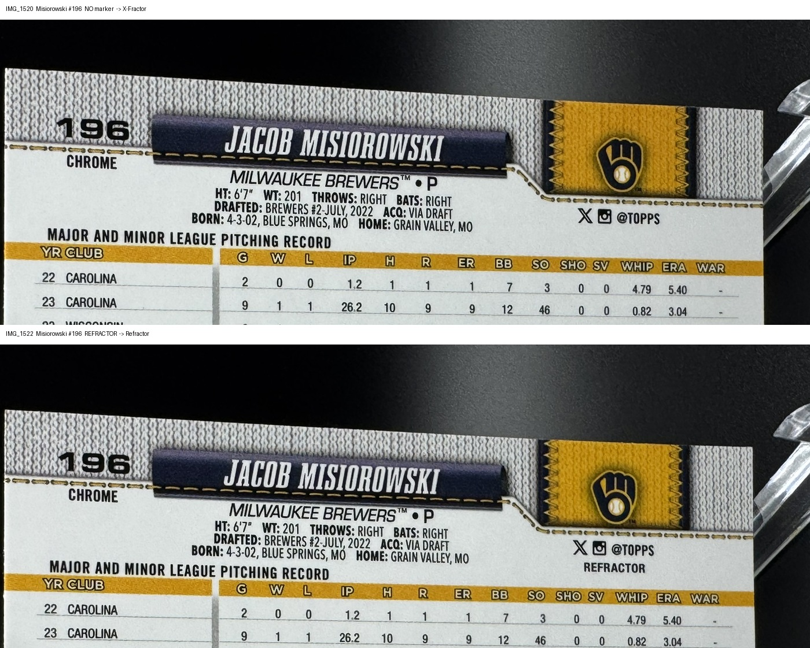
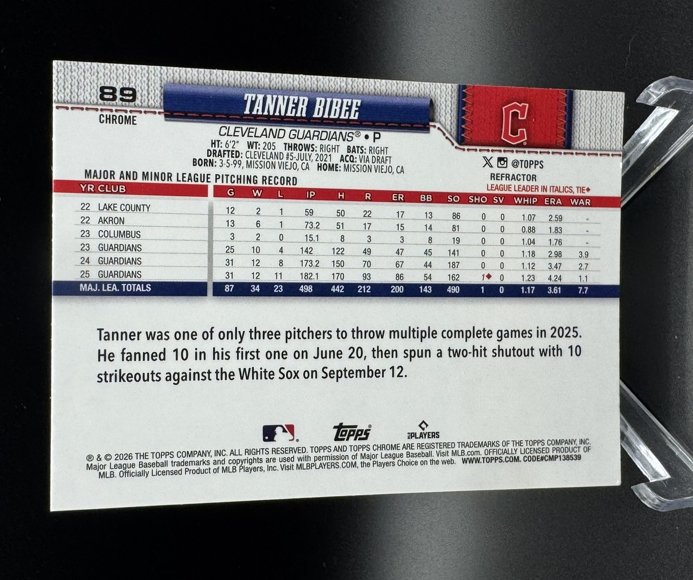

# Card intake

Read this before looking at a single card photo. Every rule below exists because
the same mistake was made more than once.

## 0. Scope

Section 1 (the back marker) is verified on **2026 Topps Chrome only**. Michael's
standing caution: *"this refractor rule probably only applies to topps chrome
2026."* Treat it as unverified for any other product, including Topps Finest,
Sapphire and earlier Chrome years.

**2026 Bowman Chrome has since been checked and it DOES have the marker**, on
the plain Refractor only, in the same spot. Corrected 2026-10-07 after two live
cards contradicted the earlier note. See section 1b.

**A control pair only proves what its own two cards show.** The Bowman Chrome
error came from a control pair of two COLOURED parallels, neither of which can
carry the word on any product. When you build a control pair, one of the two
must be the plain undesigned Refractor, or the pair cannot answer the question
you are asking it.

For a product not on that list, do **not** assume the marker exists or sits in
the same place. Find a control pair first: two copies of the same card number
where the parallel differs, and see what actually changes on the back. Until you
have that, flag the card `confirm parallel` rather than guessing (section 6),
and update this skill once a product is confirmed.

## 1. The parallel marker (2026 Topps Chrome). Do not do this from memory.

The two words live in **opposite top corners**, which is why every prose
description of them gets transposed between sessions. This has now been
"discovered" three times. Look at the picture instead:



Same player, same card number, photographed minutes apart. The only difference
is the word under `@TOPPS`.

| word | where it sits | what it means |
|---|---|---|
| `CHROME` | top **LEFT**, directly under the card number | **nothing.** It is on every single card. It is never the tell. |
| `REFRACTOR` | top **RIGHT**, directly under `@TOPPS`, beside the team logo | this card is a **Refractor** |

Full upright back for orientation: 

### Decision procedure

1. Orient the back **upright** first. These get photographed rotated 90 degrees,
   and a rotated card is how "left" and "right" get swapped.
2. Find `@TOPPS` in the top right, next to the team logo.
3. Look **directly under `@TOPPS`**:
   - word `REFRACTOR` present -> **plain base Refractor**, and you are done
   - nothing there -> go to step 4. **This does NOT mean base.**
4. Now look at the **front** and name the design. The word `REFRACTOR` appears
   **only on the undesigned base Refractor**. Every *named* parallel carries a
   visible pattern instead and never carries the word:

   | what the front shows | parallel |
   |---|---|
   | checkerboard foil | **X-Fractor** |
   | sweeping rainbow waves | **RayWave** |
   | baseball-seam pattern in the border | **Baseball Seams Refractor** |
   | red / white / blue banding | **Red White & Blue Refractor** |
   | repeating Topps logos in the foil | **Logofractor** |
   | prismatic facets | **Prism** |
   | flat, no pattern, no refraction | **base** |

5. Only call **base** when the front shows no design AND no refraction at all.

**This is the step that goes wrong.** On 2026-08-30 an entire 21-card drop was
read as "base or X-Fractor" because no back said REFRACTOR — while the fronts
plainly showed RayWave, baseball seams and RWB. Michael: *"it only says
refractor if it's just the base refractor but without like a design like raywave
or prism, so you can actually tell for certain its a refractor where the others
are obvious."* Absence of the word narrows nothing on its own; the design does
the work.

A designed parallel is **obvious** once you look for the pattern rather than for
the word. If a front refracts at all, it is not base — go find which design it
is before writing anything down.

**Do not blame the photos.** Michael's shots are consistent and the designs read
fine in them. When a parallel could not be called on 2026-08-30 the cause was
this rule, not the photography, and saying otherwise sent him to re-shoot a card
that was already perfectly legible. If a card cannot be called, the default
assumption is that the reader is looking for the wrong thing.

**The one genuinely hard case is a Logofractor INSERT.** On a base card the
repeating Topps logos sit against a plain field and jump out. On an insert --
Future Stars, Wrecking Crew, Big Ticket Players -- the design is already busy,
and the logo pattern hides inside it. Michael: *"the refractors are all easily
identifiable other than a couple logofractors that are inserts like future
stars."* For an insert, look specifically at the flat background areas between
design elements and check whether the Topps logo repeats there; do not conclude
"no logos" from a glance at a patterned card.

You need **both faces** for every card. A parallel call from one face is a guess.

### WHERE the marker actually is

Not in the top strip beside the card number. **It sits BELOW the team-logo
patch**, roughly `x 0.56-0.84, y 0.18-0.34` of a landscape phone photo of the
back, under the `@TOPPS` line:

```
274                                       [team logo patch]
CHROME   MUNETAKA MURAKAMI
         CHICAGO WHITE SOX - 1B            X (o) @TOPPS
         HT / WT / BATS / THROWS           REFRACTOR      <-- here
```

Five separate crops looked for it in the top band and found nothing, which
reads exactly like "no marker present" and would have filed 22 Refractors as
base. Reading ONE back at full resolution settled in a single look what the
crops could not. **When a marker seems absent, verify the crop is actually
looking at the right place before believing it.**

### If you cannot read it, zoom

The marker is small print. Do not squint at a full-frame photo. Crop the card's
bounding box, take the top-right region, upscale 3x with LANCZOS, and read that.
Guessing between base and Refractor has cost real money: four cards once went
into a $1.99 dropdown as base when they were Refractors.

## 1b. 2026 Bowman Chrome. The back marker DOES exist, on the plain Refractor only.

**Corrected 2026-10-07.** This section used to say the word did not exist on a
Bowman Chrome back at all. It does. Two cards read that night, a Chrome Prospect
Autograph (CPA-AG, 278/499) and a base card (#26, 040/499), both print
`REFRACTOR` on the back in the same place Topps Chrome does: top right, under
`@TOPPS`, beside the team logo.

The earlier reading was not wrong about its own evidence, it generalised from
the wrong control. That pair was the Orange /25 and the Blue /150, which are
*named colour* parallels. **The rule is the same one as section 1, on both
products:** the word `REFRACTOR` appears only on the UNDESIGNED, UNCOLOURED
base Refractor. Every named parallel carries its colour or its pattern instead
and never carries the word. A control pair of two coloured parallels can
therefore never show it, which is exactly what happened.

So, on 2026 Bowman Chrome:

| what the back says | what it means |
|---|---|
| `REFRACTOR` | plain Refractor, /499, and you are done |
| nothing | a named parallel OR a base card. **Go to the front.** |

Absence still narrows nothing on its own. Read the serial, then the border.

**The front test is the border, not the picture.** Crop a strip of the card's
outer border, blow it up, and look for a broad spectral sweep across the dark
area. A refracting card bands orange/yellow/green; a base card stays flat
neutral. Do this against known anchors from the same box rather than in the
abstract, because a chrome card is a mirror and lighting alone will not fool a
side-by-side. That box happened to yield Murakami #76 twice, once refracting and
once not, which is what made the test trustworthy.

**Read the serial before naming any colour.** Every numbered parallel prints it
on the front, right side, just above the nameplate, on base cards and prospects
alike. Scan all 60 fronts in one pass; do not assume an unnumbered-looking card
is unnumbered. A prospect Refractor that looked plain turned out to be 460/499.

### The 2026 ladder, measured off the cards

| tier | run |
|---|---|
| Refractor | /499 (confirmed on a prospect; sellers list the base-set one as /499 too) |
| Purple | /250 |
| Blue | /150 |
| Aqua | /125 |
| Green | /99 |
| Yellow | /75 |
| Gold | /50 |
| Orange | /25 |

**That ladder is the HOBBY ladder. MEGA boxes have their OWN ladder**, and it is
not a subset - it has run sizes the hobby ladder does not (/299, /199, /100, /15,
/10, /5) and one parallel that is not even called "Mojo".

### 2026 Bowman Chrome MEGA: Base / Prospect Mega Mojo ladder

100 cards, skip-numbered. Odds are per PACK; at 6 packs per box, divide by 6 for
per-box. Confirmed two ways - Michael supplied the checklistinsider ladder and
every odds figure matches the Topps odds sheet already in the repo
(`eBay_assets/Baseball Checklists/2026_Bowman_Chrome_Baseball_Odds.pdf`).

| parallel | run | mega odds | per box |
|---|---|---|---|
| Fuchsia Mojo Refractor | /299 | 1:77 | 1 per 13 |
| Purple Mojo Refractor | /250 | 1:92 | 1 per 15 |
| Pink Mojo Refractor | /199 | 1:115 | 1 per 19 |
| Blue Mojo Refractor | /150 | 1:153 | 1 per 26 |
| Aqua Mojo Refractor | /125 | 1:183 | 1 per 31 |
| **Steel Metal Refractor** | **/100** | 1:229 | 1 per 38 |
| Green Mojo Refractor | /99 | 1:231 | 1 per 39 |
| Yellow Mojo Refractor | /75 | 1:305 | 1 per 51 |
| Gold Mojo Refractor | /50 | 1:458 | 1 per 76 |
| Orange Mojo Refractor | /25 | 1:915 | 1 per 153 |
| Black & White Mojo Refractor | /15 | 1:1,525 | 1 per 254 |
| Black Refractor | /10 | 1:2,287 | 1 per 381 |
| Red Mojo Refractor | /5 | 1:4,578 | 1 per 763 |
| Rose Gold Mojo Refractor | 1/1 | 1:22,982 | 1 per 3,830 |

**THE SERIAL NAMES THE PARALLEL. Use this table instead of guessing a colour.**
A /100 mega card is a **Steel Metal Refractor** - note it is NOT "Steel Mojo", it is
the one rung Topps names differently, which is exactly why eyeballing the colour
failed. An Ethan Holliday BCP-209 at 095/100 read green-gold full-frame and
blue-purple in a border crop; the number settled in one lookup what the photograph
could not. Green is /99 and Steel is /100, one apart - so a colour guess here is a
coin flip and the serial is certain.

**Mega box configuration: 6 packs x 6 cards = 36.** Derived from his own six boxes
against the odds sheet, three independent ways: Prospects Lazer Refractor is 1:3
and he pulled exactly 2 per box in all six; Spring Breakout and It Came To The
League are both 1:6 and he pulled exactly 1 of each per box. Use 6 packs to convert
any mega pack-odds into per-box odds.

**Measured mega distribution, identical across all six boxes:**
10 Mojo / 2 Lazer / 2 inserts (1 SB + 1 IT) / 22 base. A box that does not land on
that shape has a misread in it - and the odds back it up (Chrome Rookie Red RC
Variation is 1:12 packs = 1 per 2 boxes, and he found 3 across 6).

### True vs Shimmer vs the patterned ones

The market calls the plain colour **"True Blue" / "True Orange"**, because Topps
also prints Wave, Reptilian, Geometric, Pulsar, Speckle and **Shimmer** versions
of the same colour at the same serial. They are different cards at different
prices: Arquette's Orange Shimmer /25 had 3 asks at $122/$145/$150 while his
True Orange /25 had 3 at $200/$299/$455.

- **Shimmer exists only for Prospects and Prospect Autographs, never for base
  cards.** So a numbered colour on a base card cannot be a Shimmer. That alone
  settles half the cases.
- Blown up, Shimmer is a streaked foil with bright metallic glints. True is dead
  smooth flat colour. Crop a small patch of pure border and upscale with NEAREST
  so the texture survives.

### "1st Bowman" is a LOGO on the card, not the BCP- prefix

**Never infer 1st Bowman from the card number.** The BCP subset holds both a
player's first Bowman card and repeat prospects, and only the first carries the
`1ST BOWMAN` logo. Out of 24 prospects in one hobby box, 17 had it and 7 did
not. Read the logo, top right of the FRONT, for every prospect.

Michael caught this after the fact: *"The Jesus made is not a 1st bowman you
realize that right"*. He was right, and so were six others, including the box's
most valuable card. "1st Bowman" had gone into the TITLE of a $145 Arquette and
an $18 Bonemer, which would have been a false claim in a live listing.

A player can have two prospect cards in the same year across the two products:
Arquette is `BCP-40` in the May flagship Bowman, which IS his 1st Bowman, and
`BCP-174` in September's Bowman Chrome, which is not. Those are different cards
and must be comped separately, so never let a "1st Bowman" title in a search
result stand in for the card in hand.

It is worth getting right because Michael's read is that the 1st Bowmans are
where the money is. But note what the numbers actually showed: a base 1st Bowman
is cheap even for the best prospect in the sport (Jesus Made comps at $5). The
money is in the 1st Bowman **autos and numbered parallels**, not the base.

### Chrome Rookie Red RC Variation

**The dollar figures below are from release week and have DECAYED. Re-comp, do
not quote them.** Measured 2026-10-05, a month after release and with mega boxes
flooding the market, a Jac Caglianone Red RC comps at **$8.10 median off 95 live
asks** (p75 $11.17, field $1.99-$35) - not the $50-55 the September numbers show.
The card is still the best thing in a typical mega box and still does not belong
in a cheap Pick-Your-Player dropdown, but price it fresh every time.

**A seller title is not a checklist.** Most eBay listings for that Caglianone
call it **#75**. The official checklist says **79** in both the regular and mega
PDFs, and the card in hand says 79. A dozen sellers agreeing does not outvote the
checklist. Resolve the number before writing a listing title, or the title is
wrong in the same way theirs are.

**The numeric base set does not parse out of the checklist PDFs.**
`scripts/parse-checklist.py` only matches letter-prefixed codes
(`^[A-Z]{1,6}-\d`), so every plain-numeric base card reads as "absent". That
absence is not evidence. To check a numeric card, pull the raw text instead:

```python
from pypdf import PdfReader
txt = "\n".join((p.extract_text() or "") for p in PdfReader(pdf).pages)
# then grep for the surname; the line reads "79 Jac Caglianone Kansas City Royals Rookie"
```

A rookie whose **MLB shield inside the RC badge is RED instead of navy** is the
`Chrome Rookie Red RC Variation`, 1:4 packs. It refracts, which makes it read as
a Refractor, and it carries no serial, which makes it read as base. It is
neither, and it is worth real money: Murakami #76 base is $7 and the Red RC is
$50; Messick #3 base is $3 and the Red RC is $55. Check the shield colour on
every rookie in the box, comparing against the other rookies in the same drop.

## 1c. Topps NOW Road to Opening Day

Read off a real card 2026-10-07 (Noah Cameron, A-NC, green 98/99 auto).

**It is a Topps NOW product, and that is the part that gets missed.** The front
prints `ROAD TO OPENING DAY` large and the `Topps NOW` logo small, so the
instinct is to call the set "Road to Opening Day". The checklist is filed under
the full name **2026 Topps NOW Road to Opening Day**, and the short name finds
nothing anywhere. The BACK settles it: it says "a 2026 Topps NOW - Road to
Opening Day" in so many words.

- Spring training product, Cactus League logo on the back.
- Card numbers: plain numerics for the base run, `A-XX` for autographs
  (initials, so Noah Cameron is `A-NC`), `DA-` for dual autographs.
- 559 checklist rows: 300 base, 194 Base Gold Foil Parallels, 56 Autographs,
  9 Dual Autographs.
- **Foil ladder, which is NOT the Bowman ladder**, so do not reuse that table:

| parallel | run |
|---|---|
| Aqua Foil | /199 |
| Blue Foil | /150 |
| Green Foil | /99 |
| Gold Foil | /50 |
| Orange Foil | /25 |
| Black Foil | /10 |
| Red Foil | /5 |
| FoilFractor | 1/1 |

The serial names the parallel here too. A green card at 98/99 is a Green Foil,
and nothing else on the ladder is /99.

## 2. Numbered parallels

The serial (`026/199`) is printed on the **front**, usually lower-left, and is
routinely half-hidden behind a player's leg or the acrylic stand. Crop and
upscale it. If a digit is genuinely obscured, record what you can read and say
in the note which digit needs confirming off the card. Never round a serial to
a "probably".

Colour names are not guessable. If you cannot source the exact parallel name,
record the colour plus the serial (`Aqua X-Fractor /199`) and flag it rather
than inventing a Topps product name.

`Lazer Refractor` is spelled with a **z**. That is Topps' own spelling, not a
typo. eBay keyword search cannot settle a spelling question, it just matches
whatever you typed.

## 3. Inserts: the code prefix decides the set

The insert code in `card_number` is the **authority** on `set_name`. Never file
an insert under plain `2026 Topps Chrome`, and never invent a new spelling of an
insert name. Canonical values:

Names below are taken from the **official Topps checklist PDF**, not from
whatever spelling was already most common in the table. Two of them were wrong
when guessed that way: the `91CB-` insert is "1991 Topps **Baseball**", not
"1991 Topps 75 Years", and `BTP-` is "Big Ticket **Players**", plural.

| prefix | set_name |
|---|---|
| `91CB-` | `2026 Topps Chrome (1991 Topps Baseball insert)` |
| `PTP-` | `2026 Topps Chrome (Past to Present insert)` |
| `BTP-` | `2026 Topps Chrome (Big Ticket Players insert)` |
| `RVA-` | `2026 Topps Chrome (Chrome Rivals insert)` (AWAY variant) |
| `RVH-` | `2026 Topps Chrome (Chrome Rivals insert)` (HOME variant) |
| `WC-` | `2026 Topps Chrome (Wrecking Crew insert)` |
| `FS-` | `2026 Topps Chrome (Future Stars insert)` |
| `SN-` | `2026 Topps Chrome (Static Noise insert)` |
| `DM-` | `2026 Topps Chrome (Diamond Moments insert)` |
| `IS-` | `2026 Topps Chrome (Ink Strokes autographs)` |
| `RA-` | `2026 Topps Chrome (Rookie Autographs)` |
| `P-` | `2026 Topps Chrome (Perspectives insert)` |

Test `PTP-` and `BTP-` **before** `P-`, or the prefix match swallows them.

A prefix missing from that table is worse than a wrong set name: the card stays
in base Chrome and disappears from the insert count entirely. `RVH-` was missing
at first and stranded a Reggie Jackson. Before trusting a count, list every
letter-coded `card_number` whose prefix is not in the table and resolve each one.

**Do not ask Michael what an unknown code means, and do not invent it. Look it
up on the checklist.** Every Topps product publishes one, and retailers host the
PDF (`steelcitycollectibles.com/storage/pdf/product_checklists/...`). Beckett and
checklistinsider.com carry them too. `topps.com` returns 403 to WebFetch; curl
with a browser user-agent gets through.

## 3a. Verify the whole vault against the checklist

The checklist is the only source that can catch a misread the photos agree on.

```
python scripts/parse-checklist.py <checklist.pdf> <out.json>
npx tsx scripts/verify-against-checklist.ts <out.json>
```

It matches `card_number -> player` for every letter-coded card and reports
mismatches and codes that do not exist. Two parsing traps, both already handled
in the script and both of which silently turn every double-digit card into an
"unknown code": the PDF extracts the code glued to the name (`BTP-11Juan Soto`),
so a greedy suffix eats the leading capital, and accented names lose their
characters to U+FFFD, so the comparison treats U+FFFD as a wildcard. Past to
Present entries list only the present-day player, so match on **any** surname.

Run `npx tsx scripts/normalize-insert-sets.ts` after any ingest as a check. It
only touches `2026 Topps Chrome%`; Finest and Bowman have their own families.

## 4. Photos

- Cards are shot **front, back, front, back**. Confirm the pairing on the first
  two files rather than assuming it.
- **A missing file flips the parity for everything after it.** In the 08-15 drop
  `IMG_1569` did not exist, so 1511-1568 ran odd=front while 1570-1585 ran
  even=front. Check the file list for gaps before mapping pairs.
- Assert in the ingest script that every photo is claimed by exactly one card
  and no photo on disk is left orphaned. Both checks have caught real errors.
- Upload to Supabase, verify each URL resolves, and only then archive the
  originals to `eBay_assets/_originals/`. Move, never delete.

## 5. Before inserting rows

- **Check for an existing row** with the same player + set + card number +
  parallel. Michael has twice caught a second listing being minted for a card
  he already had live at quantity 2. If it already exists and is listed, raise
  the quantity instead of creating a rival row.
- Genuine second copies from a different rip are fine, but **say so explicitly**
  in the report so he can check them against the team bags.
- Not every card belongs in the vault: no plain base unless it is an RC, a big
  name, or an MVP buyback candidate. An unexplained base card is usually a
  misread Refractor, so re-check step 1 before filing one.

## 5a. After every ingest, run the collision check

Two different players cannot hold the same `card_number` inside one set. When
they do, a number was misread. This single query found three misreads that had
been live for weeks (`WC-15` Roman Anthony was really `WC-25`, and two Ohtani
base cards logged as `#7` were really `#1`):

```sql
SELECT set_name, card_number, string_agg(DISTINCT player, ' | ') players
FROM baseball_cards
WHERE card_number IS NOT NULL AND card_number <> 'UNKNOWN'
GROUP BY 1,2 HAVING count(DISTINCT player) > 1;
```

Resolve each hit by **re-reading both cards' photos**, never by picking the one
that looks more likely. `scripts/fix-card-misreads-0816.ts` is the pattern: it
asserts the current value matches what you expect before writing, so a stale fix
cannot clobber a corrected row.

Beware of reporting bugs too. Any inventory grouped by `card_number` alone will
hide one of the two players behind a false `x2`. Group by number **and** player.

## 5b. Counts are a floor, not the truth

The vault deliberately holds fewer rows than Michael physically owns, in two
separate ways. A gap is **not** automatically an error, and "fixing" one by
inventing a row makes the data worse.

**Cheap inserts:** he photographs one copy, because they sell through a quantity
dropdown rather than as individual listings. When he reports bag counts, add the
extra copies as `needs_photos` with an empty `photo_urls` and no price, noting
that the `card_number` is assumed to match the copy already logged.

**PC duplicates are not logged at all.** One row stands for the card, however
many copies he owns. *"I have like 6 or 7 of them i just didnt add dupes to the
pc on the site. I have dupes of a lot of my pc."* On 2026-08-16 a photo showed
four signed Cova sapphires against three rows, I read the difference as a missing
card and created one, and it had to be deleted and folded back.

So: when the physical count exceeds the row count, **ask, or record it as a note
on the existing row**. Do not create a row to close the gap.

## 6. When unsure, stop

If a parallel cannot be settled from the photos, insert with
`status='photographed'`, no price, and a note containing `confirm parallel`.
The pricer skips those. That is always cheaper than a wrong call.

## 7. Pricing pulled cards

Never put the card number in the eBay Browse query. It throttles results to near
zero because most titles do not carry it. Query wide on year + set + player, and
filter on the number afterwards. "No comps" is nearly always a bad search, not a
thin market.

### Requiring the parallel is only half the filter

A query wide enough to find the card is also wide enough to find its autograph
and its /25. **Every comp needs a not-list as well as a must-list**, or the
median lands on a card Michael does not own.

On 2026-08-31 the plain Parker Messick Logofractor was priced at **$45.00**.
Michael sent a screenshot: $1.99, $3.50, $7.95. Of the 53 "comps", every one
above $10 was an on-card auto (`#RA-PM`) or a serial-numbered colour. The base
pass had an exclusion list and the parallel pass did not, so only the parallels
were wrong, and they were wrong by 9x.

For a **plain** Refractor or Logofractor, exclude:

- autos: `\bautos?\b|autograph|signed|on.?card|\bRA-|\bIS-`
- serials: `\/\s?\d{1,4}\b|\b\d{1,3}\s?\/\s?\d{1,4}\b`
- colour parallels, inserts, and any other design

For a **numbered** parallel, invert it: *require* the colour and the run size.

Both passes must also require `2026` and `Chrome` in the title. Without it,
Bowman Chrome and other years set the median.

Three traps, all hit while writing this filter:

| trap | what happens |
|---|---|
| excluding a bare colour word | "Blue Jays", "Red Sox", "White Sox" are **teams**. Only exclude a colour bound to `fractor`/`refractor`. **Re-broken and re-fixed 2026-10-05**: a bare `red` in `comp-bow3box-0917.ts` matched "Reds" and gave Alfredo Duno ZERO comps off 154 live listings. Bind every colour to a parallel word; a documented trap is not a fixed trap. |
| then excluding the RWB cards themselves | Red White & Blue **is** a colour parallel. It must be exempt from the colour rule, or Schneemann drops to zero comps. |
| `\b` before the slash in a serial | A serial is written `/50` *and* `054/150`. Requiring a word boundary before the slash matches neither, and lost every Valera Gold /50 comp. |

### A median needs a market behind it

Report the **ask count** next to every median and flag anything under 4 live
asks. One seller with no competition is an opinion, not a price. The Valera
Gold /50 shows $99.00 off a single ask; quoting that as a value would be worse
than saying nothing.
